# Courier Management System — Flowcharts

> Rendered with Mermaid. Use VS Code extension "Markdown Preview Mermaid Support" or open in any Mermaid-compatible viewer.

---

## 1. Full Operational Flow (System Overview)

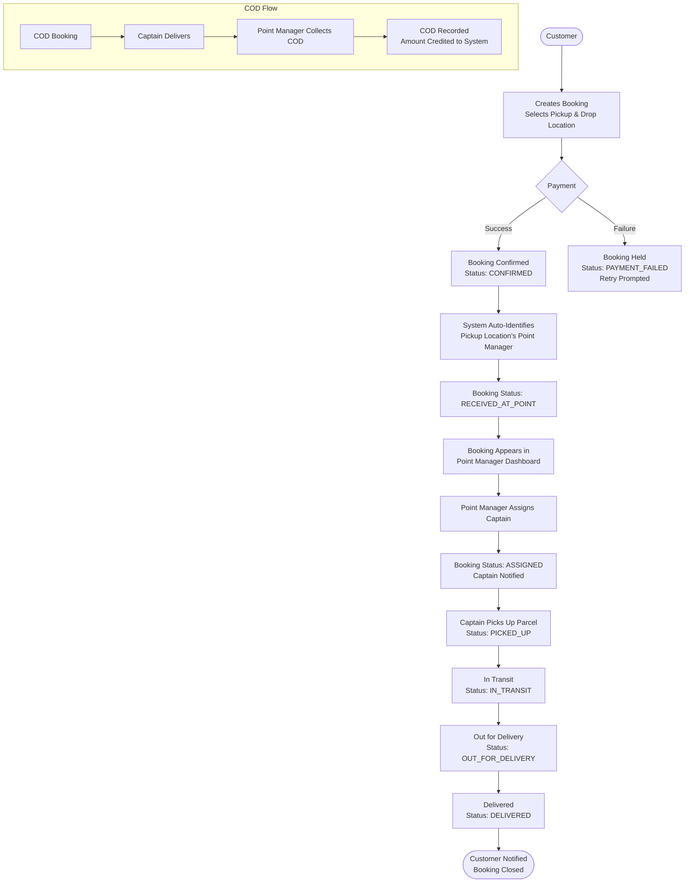

---

## 2. Customer Registration & Login Flow

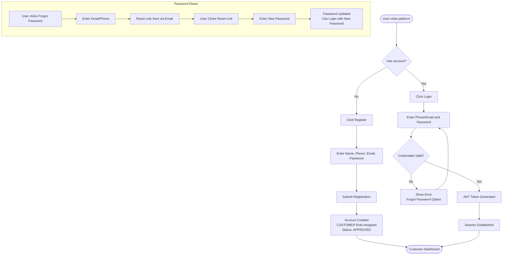

---

## 3. Point Manager Self-Registration & Approval

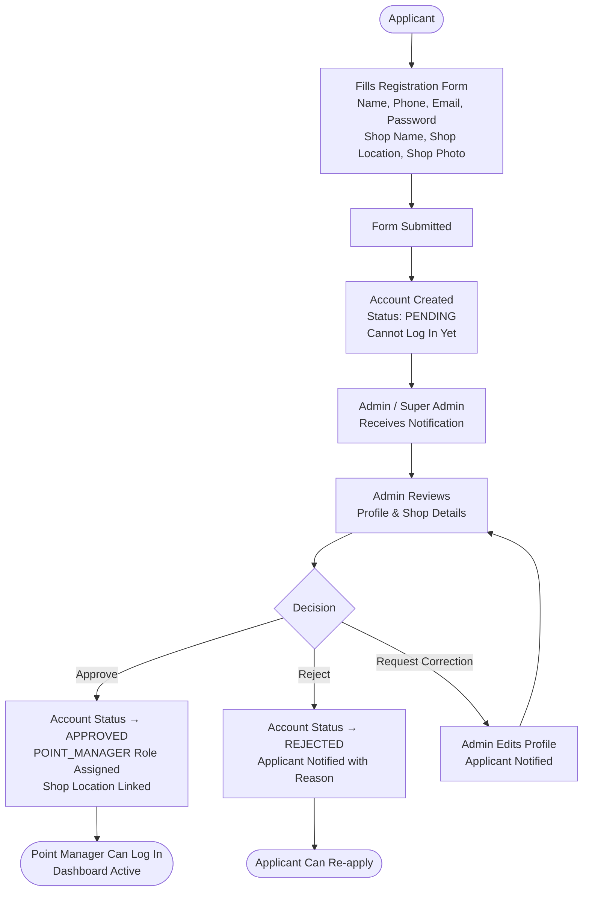

---

## 4. Captain Self-Registration & KYC Approval

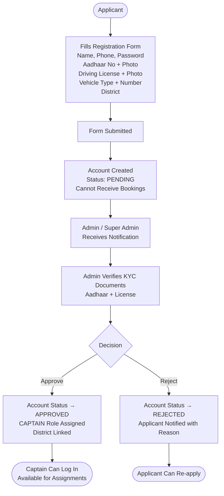

---

## 5. Booking Creation Flow

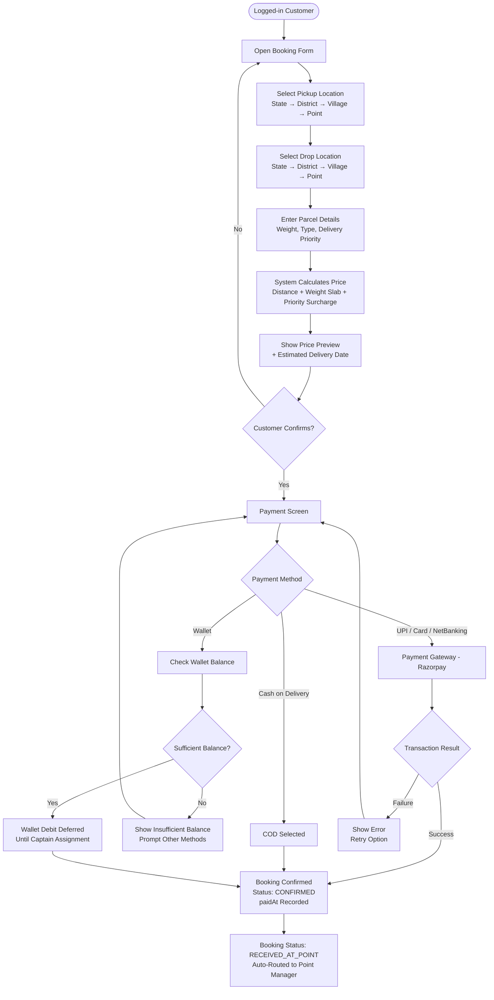

---

## 6. Auto Booking Routing Logic

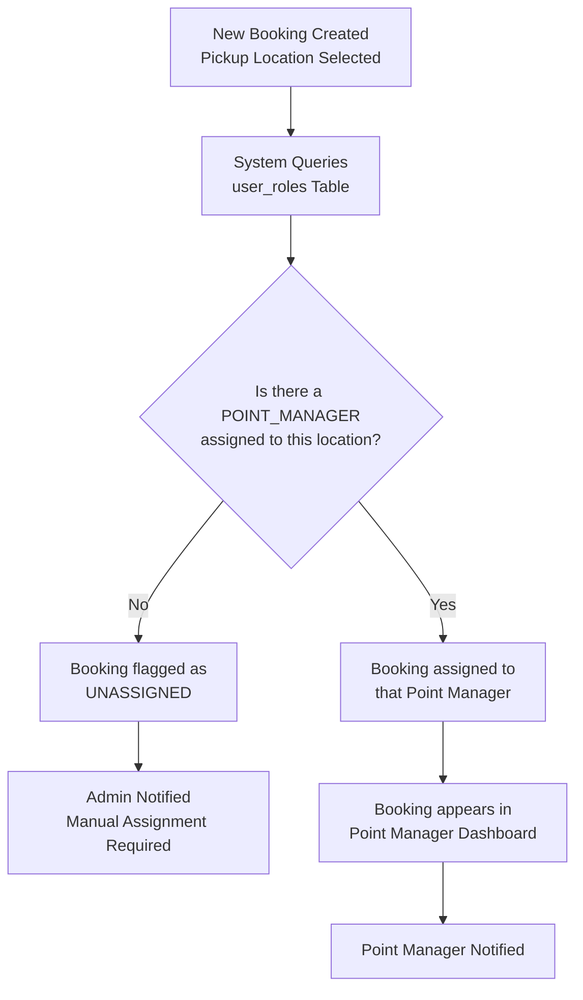

---

## 7. Captain Assignment Flow

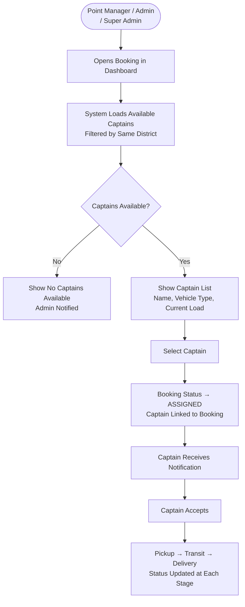

---

## 8. Payment Flow

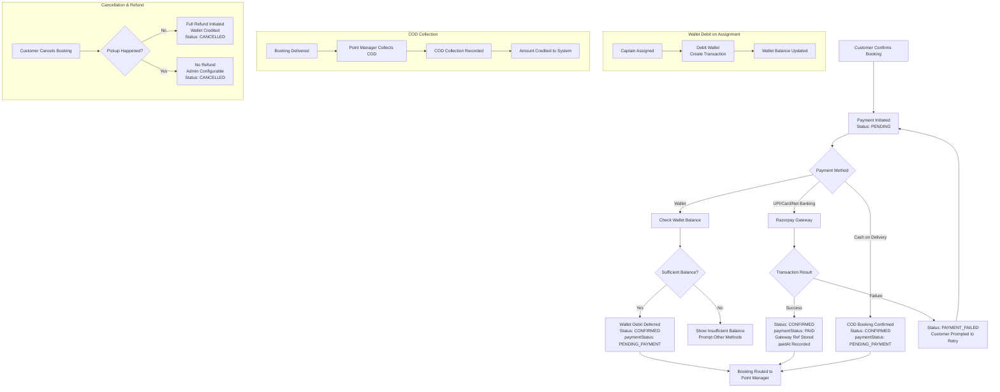

---

## 9. Permission Checking Middleware Flow

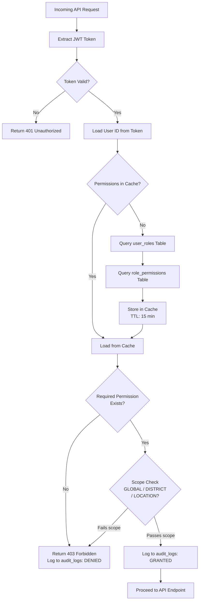

---

## 10. Profile Edit Flow (All Users)

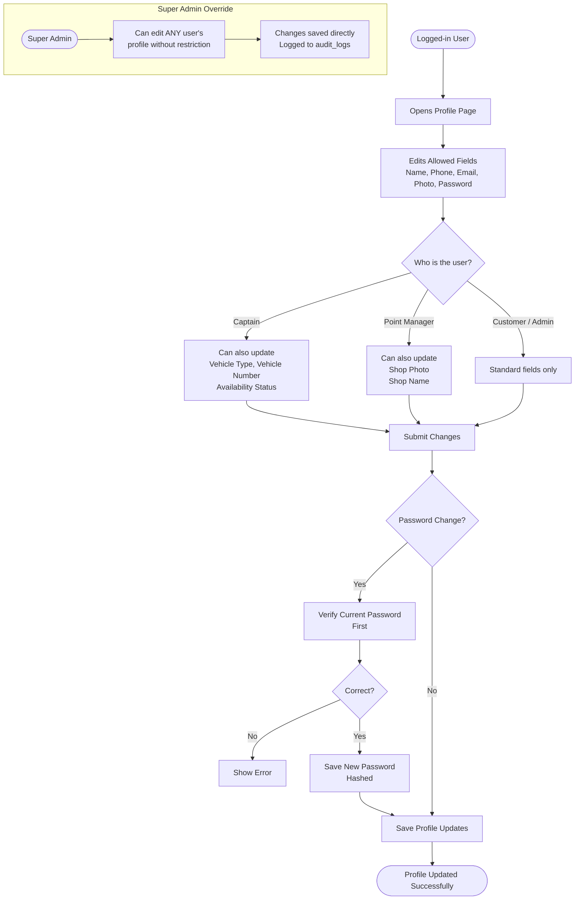

---

## 12. Entity Relationship Diagram (ERD)

```mermaid
erDiagram
    locations {
        UUID id PK
        VARCHAR state
        VARCHAR district
        VARCHAR mandal
        VARCHAR village
        VARCHAR pointName
        VARCHAR pincode
        DECIMAL latitude
        DECIMAL longitude
        ENUM locationType
        BOOLEAN isActive
    }

    users {
        UUID id PK
        VARCHAR name
        VARCHAR email
        VARCHAR phone
        VARCHAR password
        VARCHAR displayId
        ENUM approvalStatus
        BOOLEAN isActive
    }

    roles {
        UUID id PK
        VARCHAR name
        TEXT description
        INT level
        BOOLEAN isActive
    }

    permissions {
        UUID id PK
        VARCHAR name
        VARCHAR resource
        VARCHAR action
        TEXT description
    }

    role_permissions {
        UUID id PK
        UUID roleId FK
        UUID permissionId FK
        ENUM scope
    }

    user_roles {
        UUID id PK
        UUID userId FK
        UUID roleId FK
        BOOLEAN isPrimary
        UUID assignedLocationId FK
    }

    point_manager_profiles {
        UUID id PK
        UUID userId FK
        VARCHAR shopName
        UUID shopLocationId FK
        VARCHAR shopPhoto
    }

    captain_profiles {
        UUID id PK
        UUID userId FK
        VARCHAR aadhaarNumber
        VARCHAR aadhaarPhoto
        ENUM aadhaarVerificationStatus
        VARCHAR aadhaarRejectionReason
        VARCHAR drivingLicense
        VARCHAR licensePhoto
        ENUM licenseVerificationStatus
        VARCHAR licenseRejectionReason
        ENUM vehicleType
        VARCHAR vehicleNumber
        VARCHAR districtId
        ENUM availabilityStatus
        ENUM onboardingStatus
    }

    captain_point_assignments {
        UUID id PK
        UUID captainId FK
        UUID locationId FK
        BOOLEAN isActive
    }

    bookings {
        UUID id PK
        VARCHAR bookingNumber
        UUID customerId FK
        UUID pickupLocationId FK
        UUID dropLocationId FK
        UUID routeId FK
        UUID assignedPointManagerId FK
        UUID assignedCaptainId FK
        DECIMAL parcelWeight
        ENUM parcelType
        INT numberOfBags
        ENUM deliveryPriority
        ENUM vehicleType
        ENUM status
        DECIMAL calculatedPrice
        DECIMAL paidAmount
        DATE estimatedDeliveryDate
        DATE scheduledDeliveryDate
        VARCHAR deliveryTimeSlot
        ENUM paymentStatus
        ENUM paymentMethod
        VARCHAR paymentGatewayRef
        TIMESTAMP paidAt
        VARCHAR cancelReason
        VARCHAR refundId
        VARCHAR codCollectedBy
        TIMESTAMP codCollectedAt
        VARCHAR codCollectedAtLocation
        VARCHAR receiverName
        VARCHAR receiverPhone
        VARCHAR deliveryOtp
        TIMESTAMP deliveryOtpExpiresAt
        VARCHAR pickupValidationImage
        VARCHAR dropValidationImage
        VARCHAR deliveryProof
        VARCHAR deliverySignature
    }

    booking_segments {
        UUID id PK
        UUID bookingId FK
        UUID routeSegmentId FK
        INT sequenceOrder
        ENUM status
        UUID assignedPointManagerId FK
        UUID assignedCaptainId FK
        ENUM vehicleType
        TIMESTAMP handedOffAt
        TIMESTAMP deliveredAt
        VARCHAR codCollectedBy
        TIMESTAMP codCollectedAt
        VARCHAR codCollectedAtLocation
    }

    routes {
        UUID id PK
        VARCHAR name
        UUID sourceLocationId FK
        UUID destinationLocationId FK
        BOOLEAN isActive
        INT estimatedDays
    }

    route_segments {
        UUID id PK
        UUID routeId FK
        INT sequenceOrder
        UUID fromLocationId FK
        UUID toLocationId FK
        DECIMAL distanceKm
        INT estimatedHours
    }

    route_pricing_rules {
        UUID id PK
        UUID routeId FK
        ENUM vehicleType
        DECIMAL minWeight
        DECIMAL maxWeight
        DECIMAL basePrice
        DECIMAL pricePerKm
        DECIMAL weightSurcharge
        ENUM priority
        BOOLEAN isActive
    }

    route_commission_rules {
        UUID id PK
        UUID routeSegmentId FK
        ENUM vehicleType
        DECIMAL captainCommissionPct
        DECIMAL pmCommissionPct
        BOOLEAN isActive
    }

    global_commission_rules {
        UUID id PK
        ENUM vehicleType
        DECIMAL captainCommissionPct
        DECIMAL pmCommissionPct
        BOOLEAN isActive
    }

    commission_ledger {
        UUID id PK
        UUID userId FK
        UUID bookingSegmentId FK
        ENUM role
        DECIMAL amount
        ENUM status
        TIMESTAMP paidAt
    }

    pricing_rules {
        UUID id PK
        UUID sourceLocationId FK
        UUID destinationLocationId FK
        ENUM vehicleType
        ENUM deliveryPriority
        DECIMAL minWeight
        DECIMAL maxWeight
        DECIMAL basePrice
        DECIMAL pricePerKm
        DECIMAL weightTier1Limit
        DECIMAL weightTier1Surcharge
        DECIMAL weightTier2Limit
        DECIMAL weightTier2Surcharge
        DECIMAL weightTier3Surcharge
        DECIMAL weightSurcharge
        INT estimatedDeliveryDays
    }

    vehicle_configurations {
        UUID id PK
        ENUM vehicleType
        VARCHAR displayName
        VARCHAR description
        DECIMAL defaultWeight
        DECIMAL maxWeight
        VARCHAR icon
        BOOLEAN isActive
        INT sortOrder
    }

    distance_pricing_tiers {
        UUID id PK
        UUID vehicleConfigId FK
        DECIMAL minDistance
        DECIMAL maxDistance
        DECIMAL pricePerKm
        INT sortOrder
        BOOLEAN isActive
    }

    wallets {
        UUID id PK
        UUID userId FK
        DECIMAL balance
        BOOLEAN isActive
    }

    wallet_transactions {
        UUID id PK
        UUID walletId FK
        UUID userId FK
        ENUM type
        DECIMAL amount
        DECIMAL balanceBefore
        DECIMAL balanceAfter
        VARCHAR description
        VARCHAR referenceId
        VARCHAR referenceType
        JSON metadata
    }

    withdrawal_requests {
        UUID id PK
        UUID userId FK
        UUID walletId FK
        DECIMAL amount
        ENUM status
        UUID payoutDetailsId FK
        TIMESTAMP processedAt
        VARCHAR processedBy
        VARCHAR rejectionReason
        VARCHAR transactionId
        VARCHAR notes
    }

    payout_details {
        UUID id PK
        UUID userId FK
        ENUM type
        VARCHAR upiId
        VARCHAR bankName
        VARCHAR accountNumber
        VARCHAR ifscCode
        VARCHAR accountHolderName
        BOOLEAN isDefault
    }

    admin_payment_settings {
        UUID id PK
        VARCHAR bankName
        VARCHAR accountNumber
        VARCHAR ifscCode
        VARCHAR accountHolderName
        VARCHAR upiId
        VARCHAR qrCodeUrl
        BOOLEAN isActive
    }

    cod_collections {
        UUID id PK
        UUID userId FK
        UUID bookingId FK
        DECIMAL amount
        TIMESTAMP collectionDate
        VARCHAR collectedBy
        ENUM collectionMethod
        ENUM status
        VARCHAR notes
    }

    cod_remittances {
        UUID id PK
        UUID collectionId FK
        UUID userId FK
        DECIMAL amount
        ENUM remittanceMethod
        TIMESTAMP remittanceDate
        VARCHAR transactionId
        VARCHAR bankReferenceNumber
        ENUM status
        VARCHAR notes
    }

    coupons {
        UUID id PK
        VARCHAR code
        ENUM type
        ENUM discountType
        DECIMAL discountValue
        DECIMAL minOrderValue
        DECIMAL maxDiscountAmount
        INT usageLimit
        INT usageCount
        DATE validFrom
        DATE validUntil
        BOOLEAN isActive
        TEXT applicableUsers
        TEXT applicableRoutes
    }

    coupon_usage {
        UUID id PK
        UUID couponId FK
        UUID userId FK
        UUID bookingId FK
        DECIMAL discountAmount
    }

    referrals {
        UUID id PK
        UUID referrerId FK
        UUID refereeId FK
        DECIMAL bonusAmount
        BOOLEAN referrerEarned
        BOOLEAN refereeEarned
        TIMESTAMP completedAt
    }

    support_tickets {
        UUID id PK
        UUID userId FK
        VARCHAR subject
        TEXT description
        ENUM status
        ENUM priority
        TIMESTAMP createdAt
        TIMESTAMP updatedAt
    }

    support_messages {
        UUID id PK
        UUID ticketId FK
        UUID userId FK
        TEXT message
        BOOLEAN isAdmin
        TIMESTAMP createdAt
    }

    contact_submissions {
        UUID id PK
        VARCHAR name
        VARCHAR email
        VARCHAR phone
        VARCHAR subject
        TEXT message
        ENUM status
        TIMESTAMP createdAt
    }

    testimonials {
        UUID id PK
        VARCHAR customerName
        VARCHAR customerLocation
        INT rating
        TEXT content
        BOOLEAN isApproved
        BOOLEAN isActive
    }

    blogs {
        UUID id PK
        VARCHAR title
        VARCHAR slug
        TEXT excerpt
        TEXT content
        VARCHAR coverImage
        VARCHAR author
        BOOLEAN isPublished
        TIMESTAMP publishedAt
        VARCHAR metaTitle
        TEXT metaDescription
        VARCHAR metaKeywords
        VARCHAR ogImage
        VARCHAR canonicalUrl
    }

    blog_categories {
        UUID id PK
        VARCHAR name
        VARCHAR slug
        TEXT description
        BOOLEAN isActive
    }

    blog_tags {
        UUID id PK
        VARCHAR name
        VARCHAR slug
        BOOLEAN isActive
    }

    blog_category_on_blog {
        UUID id PK
        UUID blogId FK
        UUID categoryId FK
    }

    blog_tag_on_blog {
        UUID id PK
        UUID blogId FK
        UUID tagId FK
    }

    notifications {
        UUID id PK
        UUID userId FK
        VARCHAR type
        VARCHAR title
        VARCHAR message
        BOOLEAN read
        UUID bookingId FK
    }

    ratings {
        UUID id PK
        UUID fromUserId FK
        UUID toUserId FK
        UUID bookingId FK
        INT rating
        TEXT comment
        TIMESTAMP createdAt
    }

    messages {
        UUID id PK
        UUID senderId FK
        UUID receiverId FK
        UUID bookingId FK
        TEXT content
        BOOLEAN isRead
        TIMESTAMP createdAt
    }

    user_fcm_tokens {
        UUID id PK
        UUID userId FK
        VARCHAR fcmToken
    }

    password_resets {
        UUID id PK
        UUID userId FK
        VARCHAR token
        TIMESTAMP expiresAt
        BOOLEAN used
    }

    otp_codes {
        UUID id PK
        VARCHAR email
        VARCHAR code
        TIMESTAMP expiresAt
        BOOLEAN used
    }

    favorite_locations {
        UUID id PK
        UUID userId FK
        UUID locationId FK
        VARCHAR alias
        TIMESTAMP createdAt
    }

    audit_logs {
        UUID id PK
        UUID userId FK
        VARCHAR action
        VARCHAR resource
        ENUM result
        VARCHAR ipAddress
        VARCHAR userAgent
        TIMESTAMP timestamp
    }

    users ||--o{ user_roles : "has"
    roles ||--o{ user_roles : "assigned via"
    locations ||--o{ user_roles : "scoped to"

    roles ||--o{ role_permissions : "has"
    permissions ||--o{ role_permissions : "belongs to"

    users ||--o| point_manager_profiles : "has profile"
    users ||--o| captain_profiles : "has profile"
    locations ||--o| point_manager_profiles : "assigned to"

    captain_profiles ||--o{ captain_point_assignments : "assigned to"
    locations ||--o{ captain_point_assignments : "at"

    users ||--o{ bookings : "places (customer)"
    users ||--o{ bookings : "manages (point manager)"
    users ||--o{ bookings : "delivers (captain)"
    locations ||--o{ bookings : "pickup at"
    locations ||--o{ bookings : "drops at"
    routes ||--o{ bookings : "on route"

    bookings ||--o{ booking_segments : "has"
    route_segments ||--o{ booking_segments : "for"

    locations ||--o{ route_segments : "from"
    locations ||--o{ route_segments : "to"
    routes ||--o{ route_segments : "contains"

    routes ||--o{ route_pricing_rules : "has"
    route_segments ||--o{ route_commission_rules : "has"

    booking_segments ||--o{ commission_ledger : "generates"
    users ||--o{ commission_ledger : "receives"

    vehicle_configurations ||--o{ distance_pricing_tiers : "has"

    users ||--o| wallets : "has"
    wallets ||--o{ wallet_transactions : "has"
    wallets ||--o{ withdrawal_requests : "for"

    users ||--o| payout_details : "has"
    payout_details ||--o{ withdrawal_requests : "used for"

    bookings ||--o| cod_collections : "generates"
    users ||--o{ cod_collections : "collects"
    cod_collections ||--o{ cod_remittances : "remitted as"
    users ||--o{ cod_remittances : "remits"

    coupons ||--o{ coupon_usage : "used in"
    users ||--o{ coupon_usage : "uses"
    bookings ||--o{ coupon_usage : "applied to"

    users ||--o{ referrals : "refers"
    users ||--o{ referrals : "referred by"

    users ||--o{ support_tickets : "creates"
    support_tickets ||--o{ support_messages : "has"

    users ||--o{ contact_submissions : "submits"

    users ||--o{ testimonials : "writes"

    blogs ||--o{ blog_category_on_blog : "categorized by"
    blog_categories ||--o{ blog_category_on_blog : "applies to"
    blogs ||--o{ blog_tag_on_blog : "tagged with"
    blog_tags ||--o{ blog_tag_on_blog : "applies to"

    users ||--o{ notifications : "receives"

    users ||--o{ ratings : "gives"
    users ||--o{ ratings : "receives"
    bookings ||--o{ ratings : "for"

    users ||--o{ messages : "sends"
    users ||--o{ messages : "receives"
    bookings ||--o{ messages : "about"

    users ||--o{ user_fcm_tokens : "has"
    users ||--o{ password_resets : "requests"

    users ||--o{ favorite_locations : "saves"
    locations ||--o{ favorite_locations : "saved as"

    users ||--o{ audit_logs : "logged for"
```

---

## 11. Role & Permission Management Flow

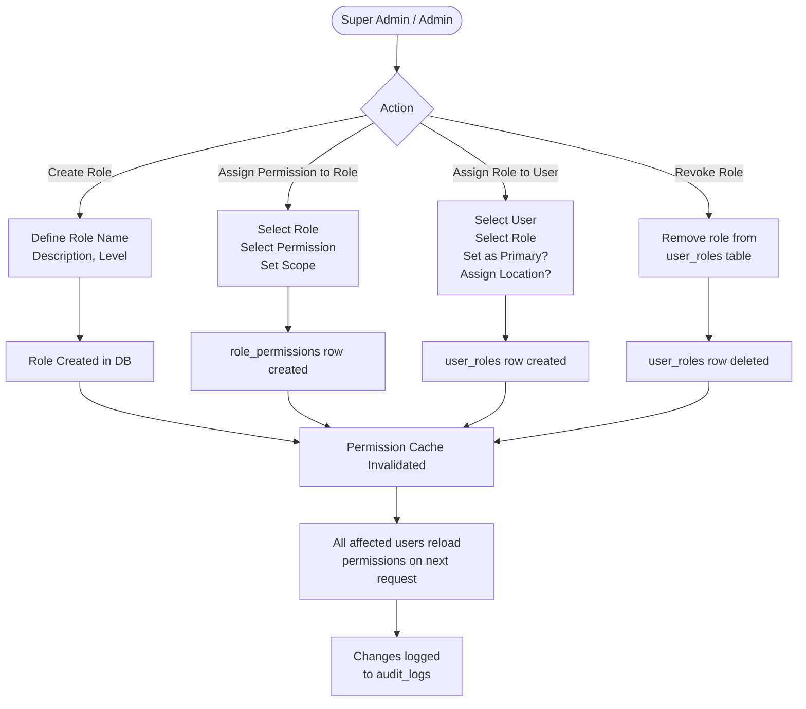

---

## 13. Wallet Management Flow

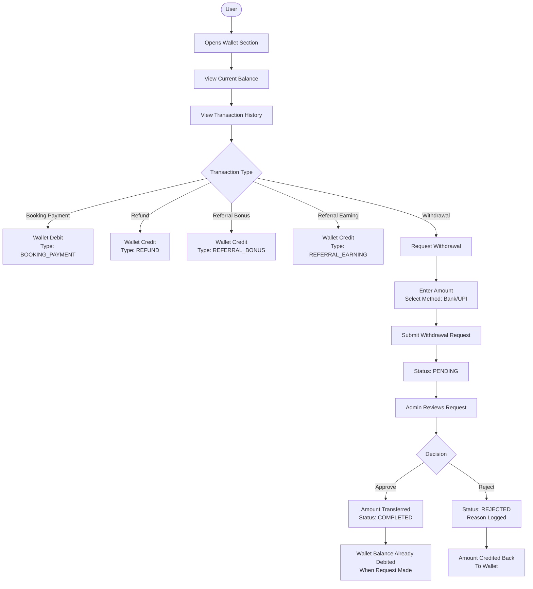

---

## 14. Referral System Flow

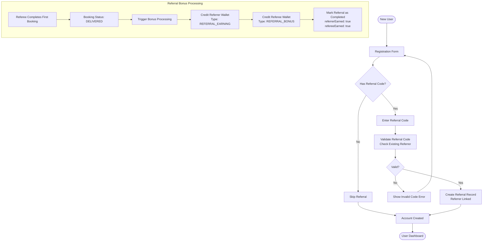

---

## 15. Support Ticket Flow

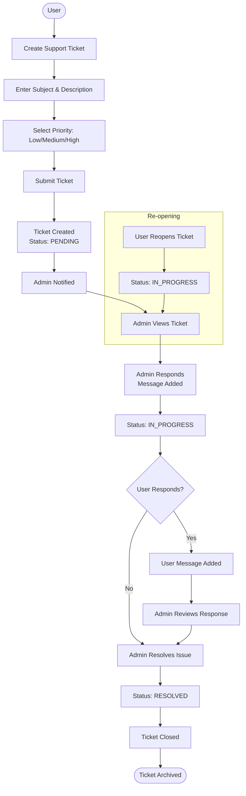

---

## 16. Commission Calculation Flow

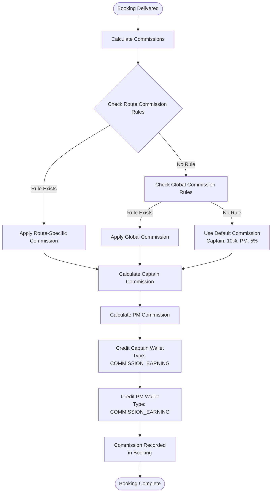
